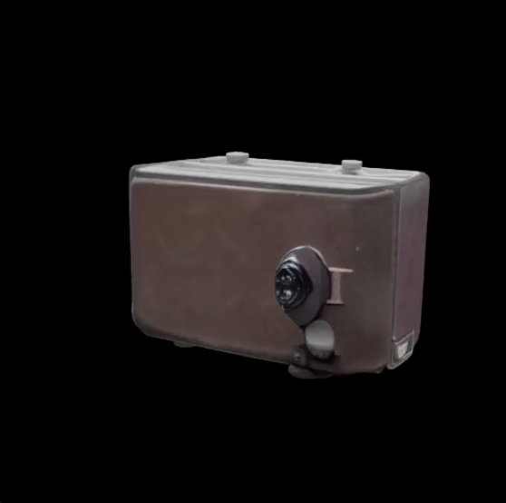
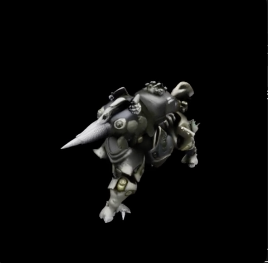
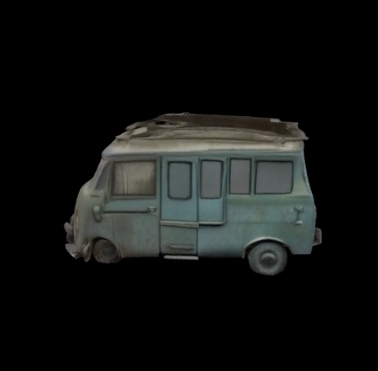

# GAP3D

This repository contains the code accompanying the paper **"GAP3D: Generative Alignment of VLM Latents to Patch-Level Embeddings for 3D Generation"**. We propose a modular, diffusion-based approach that aligns VLM-generated latents directly to the complete, patch-level feature space of a pre-trained image encoder (DINOv2), enabling a frozen downstream 3D generative model (TRELLIS) to utilize a VLM as prompt encoder while maintaining a spatially structured conditioning signal.

Our approach builds on [BLIP3-o](https://github.com/JiuhaiChen/BLIP3o), which uses a diffusion transformer to map VLM latents to a small set of pooled CLIP-style image embeddings. We extend this paradigm to the full, spatially structured patch-level embedding space of a pre-trained image encoder (DINOv2 ViT-L/14), jointly generating CLS, 4 register, and 1369 patch tokens from a frozen Qwen2.5-VL-3B VLM. The generated embeddings are fed into the frozen [TRELLIS](https://github.com/microsoft/TRELLIS) image-to-3D pipeline, enabling modular text-to-3D and emergent multimodal-to-3D generation without end-to-end retraining.

| Prompt | Generated Asset |
|--------|----------------|
| *"Vintage camera with leather case."* |  |
| *"Portable transistor radio, dark cover, speaker grille, brand logo on front."* |  |
| *"Metallic dog-like robot with articulated legs and futuristic design elements."* |  |
| *"A weather-worn vintage delivery van with a boxy shape, a rusted faded green finish, square windows, rusty roof rack."* |  |

GAP3D is built around, and modifies, two existing open-source components:

- **BLIP3-o** (in `BLIP3o/`): our fork/extension of the unified multimodal BLIP3-o model, where we replace the original diffusion transformer head to jointly generate DINOv2 CLS, register, and patch embeddings from VLM latents.
- **TRELLIS** (in `TRELLIS/`): our working copy of the TRELLIS 3D asset generation codebase, with local changes for this project (e.g., BLIP-conditioned image-to-3D and evaluation utilities).

## Repository Layout

- `BLIP3o/` -- BLIP3-o codebase and training/eval scripts, **with additional code for this paper** (DINO-grid prediction head, alignment metrics, Toys4K helpers, etc.).
- `TRELLIS/` -- TRELLIS image/text-to-3D and dataset tooling, **plus our integration and eval changes** (e.g., BLIP-TRELLIS pipelines and Toys4K evaluation).
- `eval/` -- Joint BLIP-TRELLIS evaluation utilities (e.g. Toys4K experiments).
- `run/` -- Convenience scripts for end-to-end inference and debugging.
- `point-e/` -- Local copy of the [Point-E](https://github.com/openai/point-e) codebase used for point-cloud feature extraction and metrics.

## Installation

```bash
conda create -n blip-trellis python=3.11 -y
conda activate blip-trellis
pip install -r requirements.txt
pip install -e BLIP3o --no-deps
```

**Requirements:** Linux, CUDA GPU (tested with CUDA 12.4), Python 3.11.

## Quickstart: Text-to-3D Demo (Single GPU)

1. Point to a trained checkpoint, and ensure you can access the TRELLIS image model from Hugging Face (`microsoft/TRELLIS-image-large`) or a local copy.

2. Run the minimal text-to-3D demo from the repo root:

   ```bash
   python text_to_3d_demo.py \
     --blip_ckpt /path/to/your_checkpoint \
     --trellis_ckpt microsoft/TRELLIS-image-large \
     --image /path/to/reference_image.png \
     --prompt "a small red toy airplane on a white background" \
     --out_dir outputs/demo_airplane
   ```

   This will:
   - Encode the text prompt via the frozen VLM and use the trained diffusion transformer to generate DINOv2-style CLS + register + patch embeddings.
   - Feed these embeddings into the frozen TRELLIS image-to-3D pipeline.
   - Save a `.glb` mesh and short rendered videos in `outputs/demo_airplane/`.

   The `--image` flag provides a reference image used by the BLIP3-o data pipeline for conditioning. The `--prompt` flag provides the text description of the desired 3D asset.

## Training

### Pre-training (Stage 1)

Pre-train the diffusion transformer and soft tokens on general-domain image-text pairs (e.g., the BLIP3-o dataset, ~31M pairs). This establishes the mapping from VLM latents to the DINOv2 embedding space.

```bash
torchrun --nproc_per_node=NUM_GPUS \
  BLIP3o/blip3o/train/train_mem.py \
  --deepspeed ./deepspeed_scripts/zero1.json \
  --model_name_or_path Qwen/Qwen2.5-VL-3B-Instruct \
  --version qwen \
  --data_type mix \
  --image_folder /path/to/image_text_dataset \
  --gen_vision_tower dinov2_vitl14_reg \
  --gen_projector_type mlp2x_gelu \
  --mm_projector_type mlp2x_gelu \
  --mm_vision_select_layer -2 \
  --mm_use_im_start_end False \
  --mm_use_im_patch_token False \
  --bf16 True \
  --output_dir /path/to/output_pretrained \
  --num_train_epochs 3 \
  --per_device_train_batch_size 16 \
  --per_device_eval_batch_size 16 \
  --gradient_accumulation_steps 1 \
  --eval_strategy steps \
  --save_strategy steps \
  --eval_steps 5000 \
  --save_steps 1000 \
  --save_total_limit 1 \
  --learning_rate 0.00028 \
  --weight_decay 0. \
  --warmup_ratio 0.003 \
  --lr_scheduler_type cosine_with_min_lr \
  --lr_scheduler_kwargs '{"min_lr":1e-5}' \
  --logging_steps 1 \
  --gradient_checkpointing True \
  --dataloader_num_workers 4 \
  --lazy_preprocess True \
  --gen_pooling None \
  --n_und_query 0 \
  --report_to wandb \
  --run_name blip3o_dinov2_pretrain \
  --model_max_length 512 \
  --n_query 64 \
  --predict_dino_grid True \
  --num_register_tokens 4 \
  --eval_use_memmap False \
  --eval_mapper_image_folder /path/to/eval_images \
  --eval_mapper_num_samples 4096
```

### Fine-tuning (Stage 2)

Fine-tune on domain-specific 3D asset renderings to bridge the distribution shift between natural images and synthetic 3D renders. Point `--model_name_or_path` to the pre-trained checkpoint from Stage 1 and `--image_folder` to the rendered 3D asset dataset.

```bash
torchrun --nproc_per_node=NUM_GPUS \
  BLIP3o/blip3o/train/train_mem.py \
  --deepspeed ./deepspeed_scripts/zero2.json \
  --model_name_or_path /path/to/pretrained_checkpoint \
  --version qwen \
  --data_type mix \
  --image_folder /path/to/3d_renders_dataset \
  --gen_vision_tower dinov2_vitl14_reg \
  --gen_projector_type mlp2x_gelu \
  --mm_projector_type mlp2x_gelu \
  --mm_vision_select_layer -2 \
  --mm_use_im_start_end False \
  --mm_use_im_patch_token False \
  --bf16 True \
  --output_dir /path/to/output_finetuned \
  --num_train_epochs 1000 \
  --per_device_train_batch_size 16 \
  --per_device_eval_batch_size 16 \
  --gradient_accumulation_steps 1 \
  --eval_strategy no \
  --save_strategy steps \
  --save_steps 1000 \
  --save_total_limit 1 \
  --learning_rate 0.00056 \
  --weight_decay 0. \
  --warmup_ratio 0.003 \
  --lr_scheduler_type cosine \
  --logging_steps 1 \
  --gradient_checkpointing True \
  --dataloader_num_workers 4 \
  --lazy_preprocess True \
  --gen_pooling None \
  --n_und_query 0 \
  --report_to wandb \
  --run_name blip3o_dinov2_finetune \
  --model_max_length 512 \
  --n_query 64 \
  --predict_dino_grid True \
  --num_register_tokens 4
```

## Inference

### Single-Image 3D Generation

For more control over the end-to-end pipeline (e.g., generating assets for multiple prompts or images), use the combined run script directly:

```bash
torchrun --nproc_per_node=1 run/run_combined.py
```

Arguments such as checkpoint paths and image/prompt inputs are configured inside `run/run_combined.py`. See the script for available options.

## Evaluation

### Dense Representation Alignment (Table 1)

Evaluated through `BLIP3o/eval/eval.py`. Computes cosine similarity, MSE, and norm ratio between generated and ground-truth DINOv2 embeddings.

- **COCO alignment (val2017):**

  ```bash
  torchrun --nproc_per_node=NUM_GPUS \
    BLIP3o/eval/eval.py \
    --dataset coco \
    --coco_root /path/to/coco \
    --coco_split val2017 \
    --map_to dino \
    --model_name_or_path /path/to/your_checkpoint \
    --results_dir outputs/alignment_coco
  ```

- **Toys4K alignment:**

  ```bash
  torchrun --nproc_per_node=NUM_GPUS \
    BLIP3o/eval/eval.py \
    --dataset toys4k \
    --renders_root /path/to/toys4k/renders \
    --metadata_csv /path/to/toys4k/metadata.csv \
    --map_to dino \
    --model_name_or_path /path/to/your_checkpoint \
    --results_dir outputs/alignment_toys4k
  ```

To evaluate the EVA-CLIP mapping instead of DINOv2, replace `--map_to dino` with `--map_to evaclip` and set `--model_name_or_path` to the original BLIP3-o EVA-CLIP checkpoint.

### Zero-Shot Text-to-Image Retrieval (Table 2)

Built on BLIP3-o retrieval scripts under `BLIP3o/eval/`, adapted to use DINO-grid embeddings.

- **COCO retrieval (val2017):**

  ```bash
  torchrun --nproc_per_node=NUM_GPUS \
    BLIP3o/eval/image_retrieval.py \
    --dataset coco \
    --coco-root /path/to/coco \
    --coco-split val2017 \
    --map_to dino \
    --model_name_or_path /path/to/your_checkpoint \
    --results-dir outputs/retrieval_coco
  ```

- **Toys4K retrieval:**

  ```bash
  torchrun --nproc_per_node=NUM_GPUS \
    BLIP3o/eval/image_retrieval.py \
    --dataset toys4k \
    --renders_root /path/to/toys4k/renders \
    --metadata_csv /path/to/toys4k/metadata.csv \
    --map_to dino \
    --model_name_or_path /path/to/your_checkpoint \
    --results-dir outputs/retrieval_toys4k
  ```

To run the BLIP3-o EVA-CLIP retrieval baseline, replace `--map_to dino` with `--map_to evaclip` and set `--model_name_or_path` to the original BLIP3-o EVA-CLIP checkpoint.

### Text-to-3D and Image-to-3D Evaluation on Toys4K (Table 3)

Joint evaluation code is under `eval/` (image-based FD/KD/CLIP Score in `evaluate_combined_distributed.py` and point-cloud FD/IS in `evaluate_pointcloud_distributed.py`).

- **Image-based FD/KD/CLIP (distributed over available GPUs):**

  ```bash
  torchrun --nproc_per_node=NUM_GPUS \
    eval/evaluate_combined_distributed.py \
    --renders_root /path/to/toys4k/renders \
    --metadata_csv /path/to/toys4k/metadata.csv \
    --results_dir outputs/toys4k_3d \
    --blip_ckpt /path/to/your_checkpoint
  ```

- **Point-cloud FD/IS (Point-E metrics):**

  ```bash
  torchrun --nproc_per_node=NUM_GPUS \
    eval/evaluate_pointcloud_distributed.py \
    --gt_renders_root /path/to/toys4k/renders \
    --metadata_csv /path/to/toys4k/metadata.csv \
    --results_dir outputs/toys4k_pointcloud \
    --num_assets 2500 \
    --n_views 20 \
    --n_points 4000 \
    --blip_ckpt /path/to/your_checkpoint
  ```

## Notes

- This repository contains modified copies of BLIP3-o and TRELLIS, and a local copy of Point-E. Please refer to the original projects for their licenses and detailed terms.
- For commands regarding the downloading and rendering 3D asset data, refer to the original [TRELLIS documentation](https://github.com/microsoft/TRELLIS).

## License and Acknowledgements

This repository includes modified code from the following open-source projects:

- [BLIP3-o](https://github.com/JiuhaiChen/BLIP3o)
- [TRELLIS](https://github.com/microsoft/TRELLIS)
- [Point-E](https://github.com/openai/point-e)

All original code is subject to their respective licenses (or publicly stated terms):

- BLIP3-o: see `BLIP3o/BLIP3o_LICENSE_NOTE` for the current licensing status and assumptions
- TRELLIS: see `TRELLIS/LICENSE`
- Point-E: see `point-e/LICENSE` (MIT, from the original Point-E project)

Where available, we include or reference the original license files and provide attribution in accordance with their terms. Our modifications are released under the license specified in `LICENSE` at the root of this repository.
